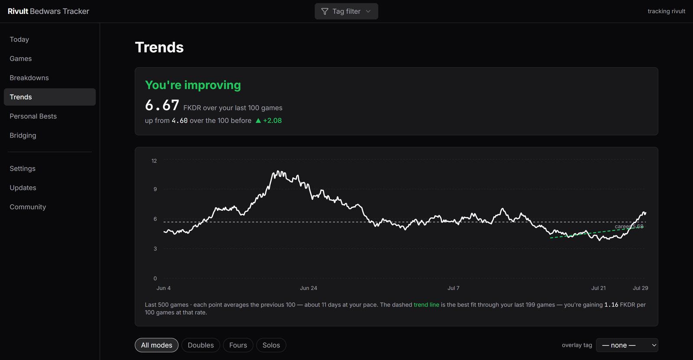
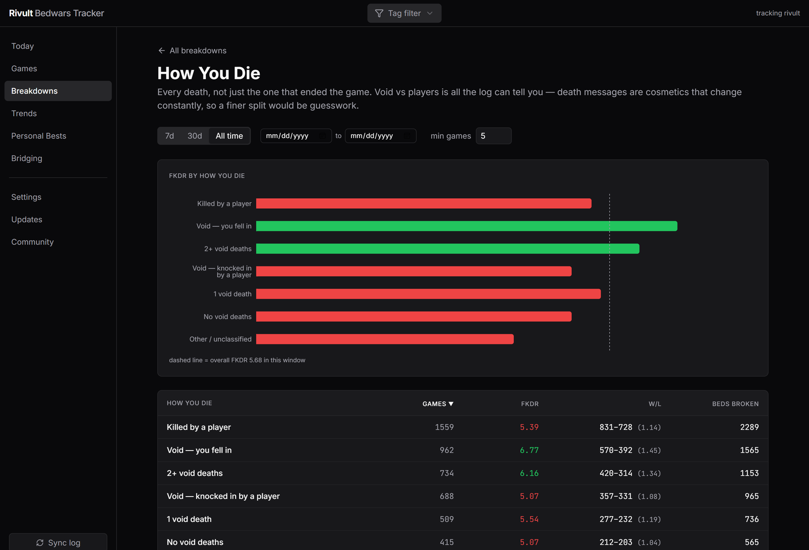
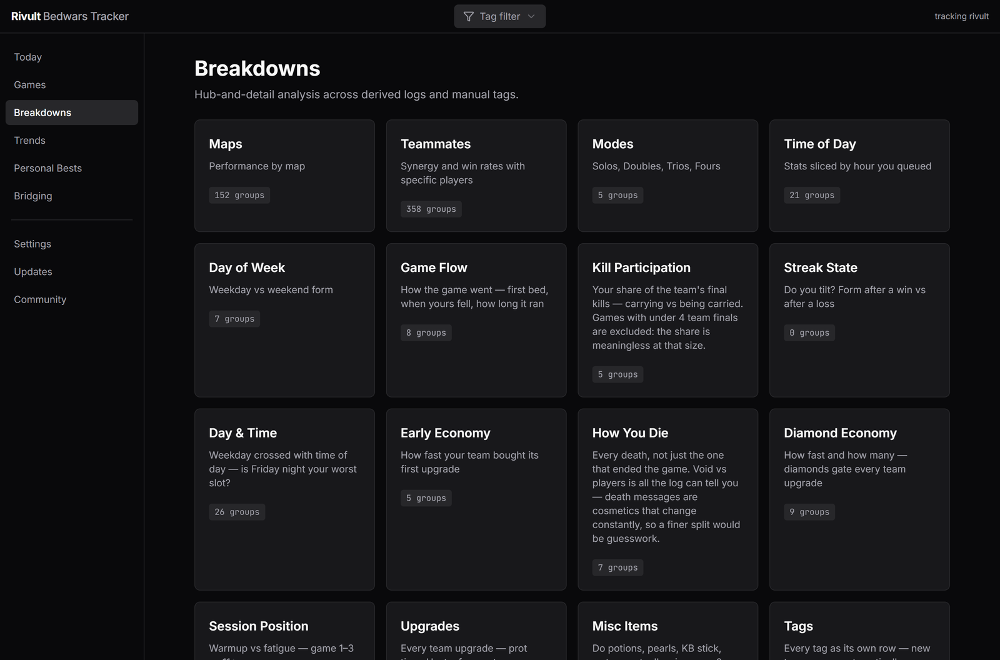
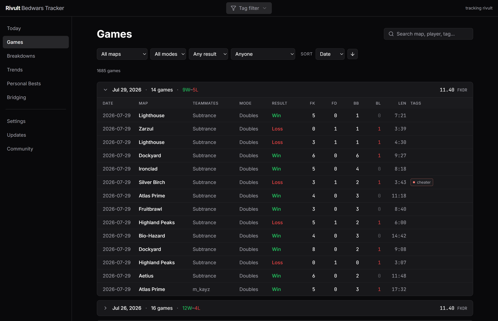

# Rivult Bedwars Tracker

**Every BedWars game you've ever played, already tracked.**

Rivult reads Minecraft's own chat log. No API key, no login, no account —
and on first launch it reads your *old* log files too, so you don't start from
zero. How far back it goes depends on how many logs your client kept; the
screenshots below are a real install with 1,685 games in it, going back to
September.

### [⬇ Download for Windows](https://github.com/rivult/rivult-tracker/releases/latest)

> **Early test build.** It works, and it's rough in places — I want to know
> where. Bug reports to **contact@rivult.net**.

---

## What you actually get

### Am I improving, or does it just feel like it?

The **Trends** page answers exactly that and nothing else. One number, one
line: your FKDR over the last 100 games against the 100 before, and a fitted
trend line showing the rate.

The x-axis is *games played*, not dates — a 100-game window can be ten days or
two months depending on how much you queued, and a date axis quietly makes
those look the same. This one doesn't.

### Where your FKDR actually goes

Sixteen breakdowns, each one a hub card that opens into a chart and a sortable
table. Maps, teammates, modes, time of day, day of week, game flow, kill
participation, streak state, diamond economy, upgrades, items, session
position.

They're built to separate, not to look busy. "Bed held" got cut because it won
99.6% of the time — holding your bed and winning are nearly the same event, so
the row was measuring itself.

### Every game, searchable

Grouped by day with the day's record and FKDR. Filter by map, mode or result,
or search any player who was in a game with you — opponents included.

### Tag a game without alt-tabbing

Press a key mid-game and it tags that game. A popup slides down from the top of
your screen in the tag's colour — over fullscreen — and that's it.

`my mistake` · `teammate diff` · `sweats` · `cheater` come pre-bound, and you
can add your own. Tags then become their own breakdown, so you can ask whether
the games you tagged `sweats` actually played differently.

### It's all local

Everything lives in `%LOCALAPPDATA%\Rivult`. Nothing is uploaded, there is no
account, and no part of this needs the internet except the update check.

---

## Setup

**1. Extract the zip.** You get a folder called `RivultTracker`. Put it
wherever you like.

**Keep the folder together** — `RivultTracker.exe` needs the `_internal`
folder next to it.

**2. Run `RivultTracker.exe`.**

**3. Windows will say "Windows protected your PC."** Click **More info** →
**Run anyway**. The app isn't code-signed; there's an
[honest explanation](#about-the-antivirus-warnings) below.

**4. The dashboard opens.** Give it a minute or two on first run — it's
importing your history from your old rotated logs, and it'll look empty until
that finishes. After that it follows your games live.

Your stats live in `%LOCALAPPDATA%\Rivult`, not the app folder, so you can move
or delete the folder without losing history.

### If it stays empty

It auto-detects Lunar, vanilla/Forge/Fabric, Badlion, Prism and MultiMC. If
nothing shows after a few minutes, go to **Settings → Log source** and pick
your client or paste the path to your `latest.log`.

### Turn on auto commands

**Settings → Auto commands.** Hypixel only tells the log which map and mode
you're on if `/locraw` runs, and only lists players if `/who` runs. Turning
this on sends both once at the start of a game, which is what makes maps,
modes and opponent search accurate. Without it those are best-effort guesses.

---

## Things that aren't obvious

### Closing minimises to the tray

**X** doesn't quit — it hides to a tray icon (bottom-right, possibly under the
`^` arrow) and keeps tracking.

- Left-click to reopen · right-click → **Exit** to quit
- Launching the exe again just reopens it, it won't start a second copy
- Prefer X to quit outright? **Settings → Window**

### Keybinds

| Tag | Key |
| --- | --- |
| my mistake | `Ctrl+Alt+F6` |
| teammate diff | `Ctrl+Alt+F7` |
| sweats | `Ctrl+Alt+F8` |
| cheater | `Ctrl+Alt+F9` |

- Press mid-game → tags that game when it ends
- Press within ~2 minutes after → tags that game
- Press again → removes the tag

Two gotchas: **a bound key is taken exclusively while Rivult runs** (a bare
F-key would break OBS or Medal, which is why the defaults are `Ctrl+Alt`
combos), and letters or digits need a modifier.

### Updates

It updates itself — the **Updates** page shows an *Install & restart* button
when a build is out. It won't interrupt a game, and a failed swap restores your
old version. Install the first one by hand.

---

## Known gaps

- **Cloud sync and accounts aren't in this build.** Written, but the server
  isn't live, so the UI is hidden rather than showing a page that only errors.
- **Maps are missing on some older games** — see auto commands above.
- **Alt accounts** are tracked separately and only your main counts. Tick
  others on in **Settings → Accounts**.
- **Dream modes** (Lucky Blocks, Ultimate, Swappage…) are tracked but kept out
  of your stats, since they aren't the same game.

---

## About the antivirus warnings

A couple of engines flag this. They're false positives, but I'd rather explain
than tell you to trust me.

It's a Python program packaged with PyInstaller. That packaging is also popular
with real malware, so scanners are suspicious of it by default — Microsoft's
flag for it literally ends in `!ml`, meaning a machine-learning guess rather
than a match.

It also does a few things that look alarming without context: it reads
Minecraft's log, watches a fixed set of eight movement keys for the bridging
analyser, can type `/locraw` if you enable that, and replaces its own folder
when updating.

What it does **not** do: capture text or passwords (the key watcher is limited
to WASD / shift / space / mouse and physically cannot read letters), touch your
Minecraft account, or upload anything.

The real fix is a code-signing certificate, which I'll buy if enough people use
this. If you'd rather not run an unsigned app, that's a completely reasonable
call.

---

## Uninstalling

Right-click the tray icon → **Exit**, delete the `RivultTracker` folder, then
delete `%LOCALAPPDATA%\Rivult`.

---

## Feedback

**contact@rivult.net** — also in the app under Updates.

Bug reports beat compliments. **If something crashed or looked wrong, attach
`rivult.log` from `%LOCALAPPDATA%\Rivult`** — that's where the errors go, and
it's usually the difference between me fixing it and me guessing.

Especially useful:

- Did it find your log on its own, or did you have to set it manually?
- How long did the first import take, and how many games did it find?
- Do the numbers match what you'd expect — FKDR, wins, final kills?
- Did a keybind fire in-game and did you see the popup? Which key, and were you
  fullscreen or borderless?
- Anything that looks wrong, empty, or confusing.
